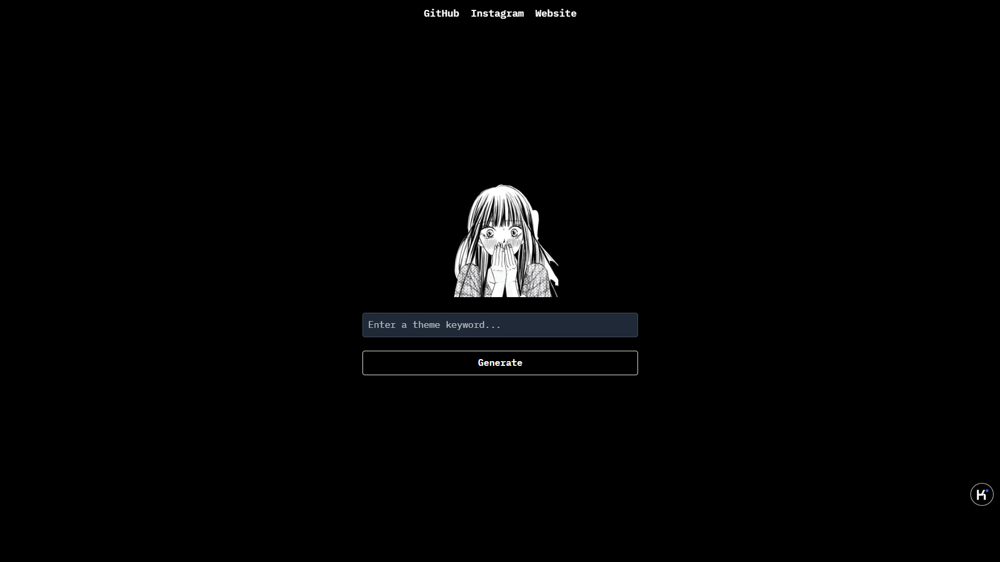

# AI Color Palette Generator 🎨  

An AI-powered web app that generates a color palette based on a given keyword.  

## 🚀 Features  
- Enter a theme keyword and get a unique color palette.  
- Minimalist dark-themed UI with TailwindCSS.  
- Fully responsive design.  
- Simple and lightweight.  

## 🛠️ Technologies Used  
- **HTML, CSS (TailwindCSS), JavaScript**  
- **Google Fonts** for typography  
- **Vercel** (Recommended for hosting)  

## 📸 Screenshot  
  
